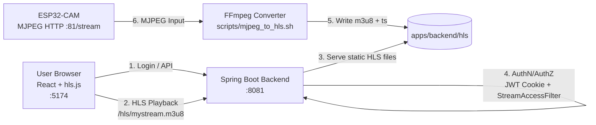
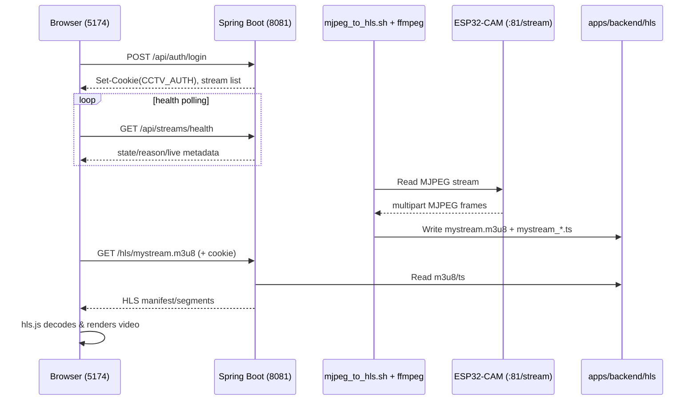

# CCTV_Streaming System Architecture

## 1) High-Level Architecture


위 그림이 실제 런타임 아키텍처입니다.
원본 편집 파일(draw.io): `docs/system_architecture.drawio`

```text
ESP32-CAM(MJPEG) -> FFmpeg(HLS) -> Spring Boot(/hls + /api) -> React(hls.js)
```



## 2) Runtime Data Flow



## 3) Component Responsibility

- Frontend (`apps/frontend`)
  - 로그인, 스트림 목록/헬스 표시, HLS 재생(hls.js)
  - API: `/api/*`, Stream: `/hls/*`
- Backend (`apps/backend`)
  - 인증/권한: `AuthController`, `JwtAuthenticationFilter`, `StreamAccessFilter`
  - 헬스 API: `GET /api/streams/health`
  - HLS 파일 정적 서빙: `HlsResourceConfig`
- Converter (`scripts/mjpeg_to_hls.sh`)
  - ESP32 MJPEG 입력을 HLS로 변환
  - `apps/backend/hls`에 출력
- Device (`apps/cctv/device`)
  - ESP32-CAM 펌웨어
  - MJPEG endpoint: `http://<device-ip>:81/stream`

## 4) Ports / Endpoints

- Frontend: `5174`
- Backend API/HLS: `8081`
- ESP32 MJPEG: `81`
- Health endpoints:
  - Backend: `GET /health`
  - Stream health: `GET /api/streams/health`

## 5) Failure Points (Most Common)

- `404 /hls/mystream.m3u8`
  - 원인: ffmpeg 변환 미실행 또는 ESP32 스트림 불가
- `403 /api/auth/login`
  - 원인: CORS origin 미허용
- `403 /hls/...`
  - 원인: 로그인 계정의 stream 권한 불일치
- `401 /api/auth/me`
  - 원인: 로그인 전/쿠키 만료/쿠키 미전달

## 6) Quick Ops Checklist

```bash
# 1) Backend
cd apps/backend
./gradlew bootRun --args='--server.port=8081'

# 2) Frontend
npm --prefix ../frontend run dev -- --host 0.0.0.0 --port 5174

# 3) MJPEG -> HLS
cd ../..
MJPEG_URL=http://<device-ip>:81/stream STREAM_ID=mystream ./scripts/mjpeg_to_hls.sh

# 4) Verify HLS output
ls -lh apps/backend/hls
```
